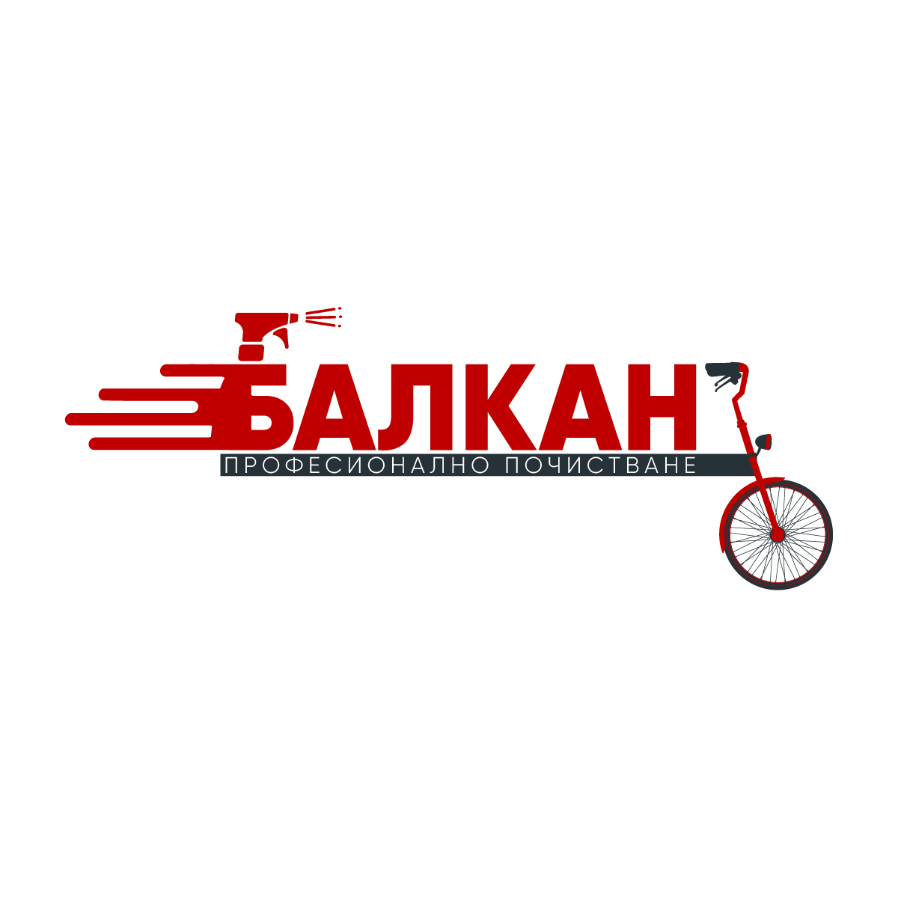

<html lang="bg">
<head>
  <meta charset="utf-8" />
  <meta name="viewport" content="width=device-width,initial-scale=1" />
  <title>Балкан – Професионално почистване | Варна</title>
  <meta name="description" content="Балкан – професионално почистване в гр. Варна. Абонаментно, еднократно, следремонтно почистване и пране на мека мебел. #дасичистачевечемодерно" />
  <link rel="canonical" href="https://Veselusha93.github.io/Balkan/" />
  <!-- Open Graph / Social -->
  <meta property="og:type" content="website" />
  <meta property="og:title" content="Балкан – Професионално почистване | Варна" />
  <meta property="og:description" content="Балкан – професионално почистване в гр. Варна. Абонаментно, еднократно, следремонтно почистване и пране на мека мебел." />
  <meta property="og:url" content="https://Veselusha93.github.io/Balkan/" />
  <meta property="og:image" content="https://Veselusha93.github.io/Balkan/logo.jpg" />
  <meta name="theme-color" content="#c81010" />

  <!-- Favicon (replace with your file) -->
  <link rel="icon" href="/favicon.ico" />

  <!-- Google Fonts: Inter -->
  <link rel="preconnect" href="https://fonts.gstatic.com" crossorigin>
  <link href="https://fonts.googleapis.com/css2?family=Inter:wght@400;600;700;800&display=swap" rel="stylesheet">

  
</head>
<body>
  <a class="skip-link" href="#main">Прескочи към съдържанието</a>
  <header role="banner">
    

      
      

        
Балкан

        
Професионално почистване — гр. Варна

      

    

    <nav role="navigation" aria-label="Основна навигация">
      <a href="#uslugi">Услуги</a>
      <a href="#ceni">Цени</a>
      <a href="#besplaten-ogled">Безплатен оглед</a>
      <a href="#kontakt">Контакти</a>
    </nav>
  </header>

  <main id="main">
    <section class="hero" aria-labelledby="hero-title">
      

        <h1 id="hero-title">Бързо. Чисто. Професионално.</h1>
        
Балкан предлага цялостни решения за почистване в гр. Варна — домове, офиси, строителни обекти. Работим с професионална техника и екологични препарати. <strong>#дасичистачевечемодерно</strong>

        

          <a class="btn" href="#kontakt">Запази почистване</a>
          <a class="btn alt" href="#uslugi">Виж услуги</a>
        

      

      <aside class="card" aria-labelledby="quick-offer">
        <h3 id="quick-offer">Бърза оферта</h3>
        <form id="quickForm" class="contact-form" aria-label="Форма за бърза оферта" method="post" action="#">
          <label class="visually-hidden" for="name">Име</label>
          <input id="name" type="text" name="name" placeholder="Име" required aria-required="true" />
          <label class="visually-hidden" for="phone">Телефон</label>
          <input id="phone" type="tel" name="phone" placeholder="Телефон" pattern="^[0-9 +()-]{6,}$" required aria-required="true" />
          <label class="visually-hidden" for="service">Услуга</label>
          <select id="service" name="service" required>
            <option value="" disabled selected>Изберете услуга</option>
            <option>Еднократно почистване</option>
            <option>Абонаментно почистване</option>
            <option>Следремонтно почистване</option>
            <option>Пране на мека мебел</option>
          </select>

          <!-- Honeypot за спам (скрито поле) -->
          

            <label>Do not fill<input name="hp" tabindex="-1" autocomplete="off" /></label>
          

          <button class="btn" type="submit">Изпрати заявка</button>
        </form>
        
Свързваме се в рамките на работния ден.

      </aside>
    </section>

    <!-- Услуги / Цени -->
    <section id="uslugi" class="services" aria-label="Услуги и цени">
      

        <h3>Абонаментно почистване</h3>
        
30 лв./час

        
Идеално решение за офиси, домове и бизнес обекти с редовна поддръжка.

      

      

        <h3>Почистване на прозорци</h3>
        
Стандартни прозорци: 5–8 лв./бр. Френски прозорци / врати: 8–15 лв./бр. Комарници: 2–5 лв./бр. Щори вътрешни: 5–10 лв./бр. Минимална такса за посещение: 60 лв. Офиси / Търговски обекти: 4–8 лв./кв.м. При високо замърсяване: +25%.

      

      

        <h3>Почистване след ремонт</h3>
        
6 лв./кв.м.

        
При силно замърсяване: +50% При много силно замърсяване: +75%

      

      

        <h3>Машинно почистване на под</h3>
        
3 лв./кв.м.

        
При силно замърсяване: +50% При много силно замърсяване: +75%

      

      

        <h3>Почистване при нанасяне / изнасяне</h3>
        
Цена по договаряне.

      

      

        <h3>Почистване на вакантни жилища</h3>
        
Цена по договаряне.

      

      

        <h3>Почистване на офиси и бизнес сгради</h3>
        
Цена по договаряне.

      

      

        <h3>Пране на мека мебел</h3>
        
Нови, актуализирани цени (виж детайли по-долу):

      

    </section>

    <!-- По-подробни цени за пране на мека мебел -->
    <section id="ceni" class="card" style="margin:20px" aria-labelledby="ceni-title">
      <h2 id="ceni-title">Пране на мека мебел — цени</h2>
      

        

          
<strong>Единичен матрак (едностранно):</strong> 20 лв.

          
<strong>Единичен матрак (двустранно):</strong> 40 лв.

          
<strong>Двоен матрак (едностранно):</strong> 40 лв.

          
<strong>Двоен матрак (двустранно):</strong> 70 лв.

        

        

          
<strong>Стол:</strong> 15 лв.

          
<strong>Диван (на седящо място):</strong> 12 лв.

          
<strong>Табуретка:</strong> 10 лв.

          
<strong>Фотьойл:</strong> 30 лв.

        

      

      
За големи обеми или силно/много силно замърсяване оферти се дават след оглед. Цените са ориентировъчни и подлежат на потвърждение при заявка.

    </section>

    <section id="besplaten-ogled" class="card" style="margin:20px" aria-labelledby="ogled-title">
      <h2 id="ogled-title">Безплатен оглед</h2>
      
Предлагаме безплатен оглед преди извършване на услугата, за да оценим нуждите и да предложим най-добра цена.

      <a class="btn" href="tel:+359890522954">Обади се за безплатен оглед</a>
    </section>

    <section id="kontakt" class="card" style="margin:20px" aria-labelledby="kontakt-title">
      <h2 id="kontakt-title">Контакти</h2>
      
Тел: <a href="tel:+359890522954">0890 522 954</a> Имейл: <a href="mailto:officebalkan@mail.bg">officebalkan@mail.bg</a>

      
Адрес: гр. Варна (замести с точен адрес за по-добро локално SEO)

    </section>

  </main>

  <footer>
    
©  Балкан – Професионално почистване, Варна | <strong>#дасичистачевечемодерно</strong>

    
Тел: <a href="tel:+359890522954">0890 522 954</a> | Имейл: <a href="mailto:officebalkan@mail.bg">officebalkan@mail.bg</a>

  </footer>

  <!-- Structured data (JSON-LD) - попълни адреса и координатите -->
  

  
</body>
</html>
